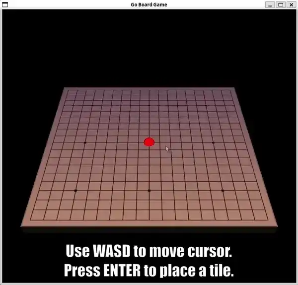

# Go Video Game Project in C++



My 4th year Computer Graphics course had an assignment asking us to develop a game using the [OpenGL graphics library](https://www.opengl.org/) and [DevIL image library](http://openil.sourceforge.net/).
The result was my group developed a 3D Go board game as seen in the video above.

## Setup

This project has only been tested on Ubuntu.
The instructions for setting up can be seen below.

### Setup on Windows Subsystem Linux 2 and Remote

This project assumes you're building on Windows Subsystem Linux 2.
[The instructions for installing can be found here](https://docs.microsoft.com/en-us/windows/wsl/install-win10).

#### Troubleshooting Desktop-Related Issues

Moreover, to run the binary, you might need to perform additional setup for a working remote desktop connection.
[The instructions for setting that up can be found here](https://harshityadav95.medium.com/install-gui-desktop-in-wsl2-ubuntu-20-04-lts-in-windows-10-ae0d8d9e4459).

### Setup the Build Environment

With the above done, you should be ready to set up the needed environment.

```shell
# install dependencies (Ubuntu/Debian)
./scripts/install_dependencies.sh
git clone https://github.com/robert-7/Go-Board-Game.git && cd Go-Board-Game
```

## Building and Running Locally

To build and run the binary, simply run `make && ./main`.
To clean up, run `make clean`.

## Building and Running with Docker

You can also run the game in a Docker container without installing dependencies on your host machine.

### Prerequisites

- Docker
- Docker Compose

### Instructions

1. **Allow X11 connections** (Linux): Since the game runs in a container but displays on your host screen, you need to allow the container to connect to your X server. Do so with: `xhost +local:docker```
1. **Build and Run**: Do so with `docker compose up --build`. The game window should appear on your screen.

## Linting

The repository uses the same commands locally and in CI. After installing the packages above, run:

```shell
./scripts/run_lint.sh
```

The script configures CMake, runs clang-tidy, and then runs cppcheck with the same settings used in CI.
It can be removed along with the `build` directory when you finish linting.

To run linting automatically before each commit, install [`pre-commit`](https://pre-commit.com/) (e.g., `pip install pre-commit` or `sudo apt install pre-commit`), then enable the hooks once:

```shell
pre-commit install
```

You can trigger the hooks manually at any time with:

```shell
pre-commit run --all-files
```

## In-Game Commands

Below are the keyboard explanations:

```plaintext
1 : Toggle specularity
3 : Toggle wireframe
5 : Toggle depth testing
6 : Toggle culling (try disabling both depth testing and culling)
7 : Toggle between smooth and flat shading
8 : Toggle texture

o,O : Toggle board rotation along the y-axis
p,P : Toggle board rotation along the x-axis
r,R : Activate "reset board option"
y,Y : Confirm  "reset board option"
n,N : Cancel   "reset board option"
v,V : Set color to white (This makes testing a bit faster)
b,B : Set color to black (This makes testing a bit faster)

wasd  : Move a piece around the board
enter : Place a piece on the board

ON RIGHT-CLICK AND HOLD MOUSE:
* slide left  : move camera left
* slide right : move camera right
* slide up    : zoom camera in
* slide down  : zoom camera out
```
